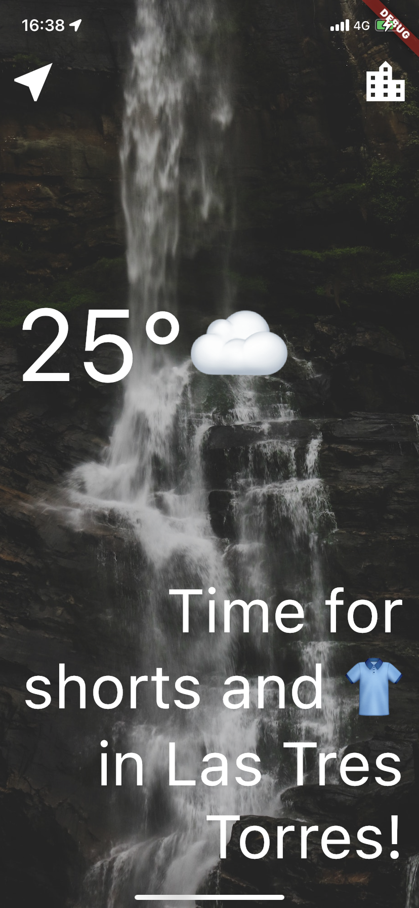
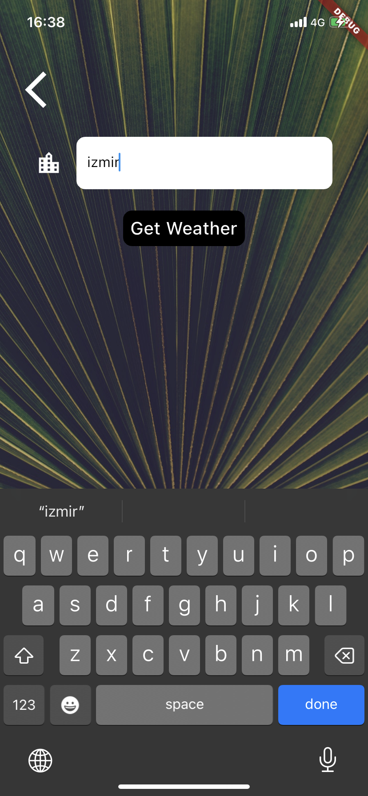

# Clima - Weather App

<p>
  
  
  
</p>

## About the Project

Clima is a user-friendly weather app developed using Flutter. The app provides real-time weather information based on the user's current location or the city name they enter. Additionally, it offers personalized recommendations based on the weather conditions, such as suggesting attire or activities for the day.

## Technologies Used 

- `Flutter`
- `Dart`

## Packages Used 

- `geolocator`: Used to determine the user's current location.
- `http`: Utilized for API communication to fetch weather data.
- `flutter_spinkit`: Added for visual feedback while data is being loaded.

## Features

- `Location Service`: The app determines the user's current location to fetch weather data.
- `City Selection`: Users can manually input the name of the city to get weather information for the desired location.
- `Weather Information`: Clima fetches real-time weather data through API and displays it to the user.
- `Temperature-based Recommendations`: Based on the weather conditions, the app provides clothing suggestions and activity recommendations.
- `User-Friendly Interface`: Clima offers a simple and intuitive user interface for quick access to weather information.

## How to Use

1. Launch the app and observe the weather information on the home screen.
2. Click the "Location Icon" button to get weather data based on your current location, or enter a city name and click the "Get Weather" button.
3. The app will fetch weather data through the API and display it on the screen.
4. Based on the daily weather information, explore the recommended activities and clothing styles.

## Installation

1. Clone the repository:
   ```
   git clone https://github.com/denaktepe/clima.git
   ```

2. Navigate to the project folder:
   ```
   cd clima
   ```
3. Change to line "const kApiKey = '';" with Your API Key from https://openweathermap.org/
   Example:
   ```
   const kApiKey = '183273218378219371'
   ```

5. Install the required dependencies:
   ```
   flutter pub get
   ```

6. Run the app:
   ```
   flutter run
   ```

## Contributions

If you would like to contribute to this project, please follow these steps:

1. Fork this repository to your GitHub account.
2. Create a new branch: `git checkout -b my-feature`
3. Make your changes and commit them: `git commit -m "A descriptive commit message"`
4. Push your changes: `git push origin my-feature`
5. Open a pull request and share your changes.

## Contact

For any questions, suggestions, or feedback, please email me at sametcagriaktepe@gmail.com.


   
